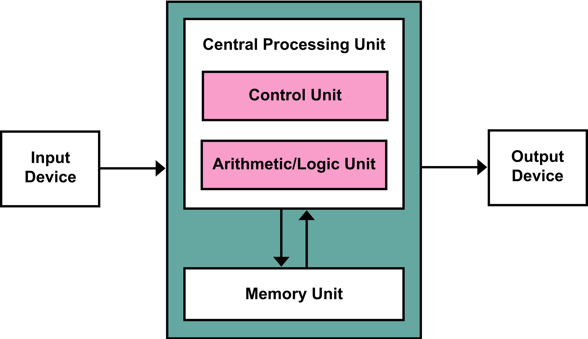

# Programsko inženjerstvo - Vježbe

[TOC]

## Uvod u JavaScript

_(prilagođeno prema knjizi Eloquent JavaScript)_

Računalo je alat i poput svakog alata ima svoju **svrhu** i **način uporabe**. Doduše, to je jedan malo **kompleksniji** alat te je samim time i izazov učiniti njegovu uporabu **jednostavnom**.  Dodatno, njegova je primjena u području upravljanja informacijama **univerzalna**. To znači da je računalno često moguće koristiti i na način na koji njegov tvorac nije predvidio.

Dinamičnost modernog, često i globalnog poslovanja te konstantnog napretka ukazuje na mnoge nove probleme za koje još nije predviđeno rješenje. Prilikom oblikovanja takvoga riješenja služimo se disciplinom programskog inženjerstva, te konkretnije aktivnošću _programiranja_ - vještinom oblikovanja računalnih _programa_.

**Računalni program** je niz **nedvosmislenih** i **preciznih instrukcija** računalu. Računalo je u tom smislu veoma "ograničeno u razumijevanju" naših nauma - razumije samo unaprijed dogovoreni set pravila u korištenju ključnjih pojmova i gradivnih elemenata programa. To povlači da je programiranje ponekad frustrirajuće i naporno. No uprkos početnoj frustraciji, ono može biti itekako zanimljivo, pa čak i zabavno.

### Programski jezik

Programski jezici su veoma važni jer su most komunikacije između čovjeka i računala u procesu oblikovanja računalnih programa. U začetku računarstva oni nisu postojali te bi klasičan program bio pisan strojnim kodim, koji bi primjerice izgledao ovako:

```assembly
00110001 00000000 00000000
00110001 00000001 00000001
00110011 00000001 00000010
01010001 00001011 00000010
00100010 00000010 00001000
01000011 00000001 00000000
01000001 00000001 00000001
00010000 00000010 00000000
01100010 00000000 00000000
```

Program se sastoji od niza unaprijed definiranih instrukcija i parametara. Instrukcije su predefinirane zavisno o arhitekturi procesora (npr. x86, ili x64, ARM, ...) gdje gotovo svaka modernija arhitektura vuče korijene iz Von Neumannove arhitekture [^https://en.wikipedia.org/wiki/X86_instruction_listings].



>  Pojednostavljeni prikaz Von Neumannova arhitekture računala.

Osnova računanja postiže se prijenosom informacija iz ulazno-izlaznih jedinica u lokalne registre (memorija u samom procesoru) i memoriju računala (RAM) te primjenom aritmetike (matematičke operacije) i logike (npr. uvjeti, petlje) nad njima.

Program koji je prethodno prikazan zbraja prvih 10 prirodnih brojeva, odnosno ispisuje rezultat matematičke operacije `1 + 2 + 3 + ... + 10 = 55`. Da bi ga lakše mogli shvatiti možemo ga prevesti na sljedeći način:

``` assembly
Spremi broj 0 u memoriju na lokaciju 0.
Spremi broj 1 u memoriju na lokaciju 1.
Spremi vrijednost koja je u memoriji na lokaciji 1 u memoriju na lokaciju 2.
Oduzmi vrijednost 11 od vrijednosti na memorijskoj lokaciji 2.
Ako je vrijednost memorije na lokaciji 2 jednaka 0 tada nastavi s instrukcijom 9.
Zbroji vrijednost s lokacije 1 i lokacije 0 te zapisi na lokaciju 0.
Dodaj 1 vrijednosti na lokaciji 1.
Nastavi s instrukcijom 3. 
Ispisi vrijednost na lokaciji 0.
```

Možeš li prepoznati obrasce poput *petlje* i *uvjetnog izvođenja*? 

Naš se program sastoji od nekoliko osnovnih instrukcija:

1) Spremanje određene vrijednosti na određnu lokaciju u memoriji (npr. prva i druga instrukcija čiji je kod `00110001`).

2) Pozivanje izvršavanja instrukcije na nekoj drugoj lokaciji u programu.

3) Osnovna aritmetika (zbrajanje, uvećavanje za 1).

4) Uvjetno izvršavanje instrukcije na nekoj drugoj lokaciji u programu.

Također vidimo da je program u ovakvom obliku puno čitljiviji, no još uvijek nije dovoljno jasan zbog toga što je čovjeku naporno vizualizirati registre, memoriju i pamtiti što se u pojedinom trenutku nalazi na pojedinoj lokaciji. Upravo je zbog toga uvedeno **simboličko mapiranje**, odnosno pridruživanje **nazivlja** pojedinim **vrijednostima**. To nam je možda poznatije pod terminom **varijable**, iako je u svojoj suštini riječ o **mapiranju**. Time naš program može izgledati primjerice ovako:

```assembly
postavi "total" na 0
postavi "count" na 1
[petlja]
	postavi "usporedba" na "count"
	oduzmi 11 od "usporedba"
	ako je "compare" = 0, skoči na [kraj]
	zbroji "count" i "total" i spremi na "total"
	dodaj 1 na "count"
	skoči na [petlja]

[kraj]
	ispiši "total"
```

Sada je program puno razumljiviji i možemo lakše shvatiti kako on funkcionira. Zadaća je **kompajlera** ili interpretera (dvije vrste programa koji ovakav simbolički jezik prevode u čisti strojni kod) jest da sva mapiranja pretvori u operacije koje barataju s registrima (što je zapravo složen i zanimljiv problem jer je broj registara ograničen u odnosu na neograničen broj varijabli https://en.wikipedia.org/wiki/Register_allocation)

Evo istog programa u programskom jeziku **JavaScript**, gdje za imenovanje (mapiranje, varijable) koristimo ključnu riječ `let`:

```javascript
let total = 0;
let count = 1;

while (count <= 10) {
  total += count;
  count += 1;
}

console.log(total); // 55
```

>  Prednost ovako napisanog programa je što ne moramo označavati lokacije sa `[petlja]` ili `[kraj]` već možemo koristiti naprednije konstrukte poput petlji `while` ili `for`.

Kada bi programski jezik podržavao naprednije konstrukte, isto bi mogli postići sa:

```python
print(sum(range(11))) # nota bene: ovo je Python :)
```

gdje do izražaja dolazi inteligentni dizajn ugrađenih funkcija (Python voli reći da dolazi s *uključenim baterijama*). Semantički ekvivalentni program je u JavaScriptu malo manje razumljiv:

```javascript
console.log([...Array(11).keys()].reduce((a, b) => a + b, 0)); // ne moraš ovo sada razumijeti! :)
```

Različiti programski jezici omogućuju različite konstrukte te je samim time pisanje programa specifično za svaki jezik. Program općenito može biti zapisan duže ili kraće, razumljivo ili nerazumljivo, a da se pritom izvodi optimalno ili suboptimalno. Dakle **dobar** program mora biti efikasan, ali istovremeno **razumljiv** programerima (n.b. široj publici, ne samo njegovom tvorcu).

### JavaScript

JavaScript je programski jezik koji je nastao 1995. kao način da se tadašnji internet preglednik *Netscape Navigator* nadopuni svojim vlastitim programskim jezikom. Naziv JavaScript upućuje na poveznicu s Javom, međutim ona ne postoji. Java je objektno-orijentirana sa strogo definiram tipovima s kodom koji se kompajlira (prevodi), dok je Javascript skriptni jezik koji se interpretira i nema strogo definirane tipove. JavaScript je prisutan u svim modernim preglednicima te je osnova gotovo svih web aplikacija. Konkuriraju mu Java i Adobe Flash tehnologije koje su gotovo u cijelosti napuštene u domeni internet preglednika. Standardiziran je u okvirima ECMAScript standarda kojeg razvija Ecma International. Posao te organizacije je da JavaScript radi podjednako neovisno o mjestu gdje se izvodi, što može biti internet preglednik, poslužitelj (npr. node.js) ili drugi uređaj. Termini ECMAScript i JavaScript mogu se mijenjati te oboje znače isto.

Kako je JavaScript _de facto_ primarni jezik internet poslužitelja možemo ga direktno izvršavti u bilo kojem poslužitelju pomoću interaktivne konzole (_Web Console_). Konzola preglednika direktno izvršava svaku unesenu liniju JavaScript koda. Primjerice, u Firefoxu je _Web Console_ dostupan pomoću kombinacije `Alt+Ctrl+K`.

JavaScript je poznat po mnogim ružnim primjerima i postoje mnogi koji će reći da jezik čudan i zbog toga loš. Istina je da problem ukoliko programer ne shvaća u potpunosti što se zbiva u pozadini njegovog koda. Evo nekolika primjera:

```javascript
0.1 + 0.2 // → 0.30000000000000004
0.1 + 0.2 === 0.3 // → false // ova usporedba rezultira sa false iako je matematički točna
x = 1.0000000000000001
x === 1 // → true // zašto pak ovo daje true?

16 == [16] // → true // Array se pretvara interno prvo u string pa u broj (zbog toga je isto)
16 == [1,6] // → false // Array pretvoren u string "1,5" pa u brojku NaN
"1,6" == [1,6] // → true

var arr = [];
arr.length // → 0
arr[3] // → "undefined" // nema greške iako polje nema treći element, samo dobijemo undefined
arr[3] = "hi"; // može se postaviti iako ne postoji drugi element :)
arr.length // → 4 // 4??? Ali ne postoji drugi element?
arr["3"] // → "hi" // "3" iako je string, pretvorio se u 3. element
```

> Kod se može isprobati u konzoli internet preglednika ili na adresi https://jsconsole.com/.

Većina ovih primjera rezultat je nepostojanja eksplicitno navedenih tipova varijabli i čudnih pravila konverzije između tipova. Jeziku se još predbacuje postojanje globalnih varijabli i činjenica da ih se može adresirati iz bilo kojeg dijela programa, onda kada i to nije bila direktna intencija.

Međutim, sa fleksibilnošću dolazi široka paleta mogućih rješenja koje se mogu izraziti JavaScriptom, dok je to teško izvedivo u programskim jezicima sa strogim tipovima. 

> With freedom comes great responsibility.

## Zadaci za vježbanje

1. Isprobati program iz skripte gore za zbrajanje prvih 10 brojeva. Možete ga isprobati u konzoli preglednika. Zatim je potrebno modificirati program na način da se uvede dodatno mapiranje (varijabla) koja će poopćiti problem i ukazivati na to koliko brojeva treba zbrojiti (npr. neka to bude varijabla `n=10`). Isprobati program za prvih 1000 brojeva (`n=1000`).
1. Istražiti što je to NodeJS te instalirati na svom računalu `node` verziju 12 ili više. (Google will help...)
1. Isprobati program za zbrajanje, ovaj puta pomoću `node`a.
1. Istražiti čemu služi `npm` te u čemu je razlika od `yarn`a.
1. Istražiti čemu služi `webpack`.
1. Napisati program za zbrajanje prvih `n` brojeva pomoću samo jedne varijable (isključujući varijablu `n`). Hint: Gauss (https://www.nctm.org/Publications/Teaching-Children-Mathematics/Blog/The-Story-of-Gauss/). 