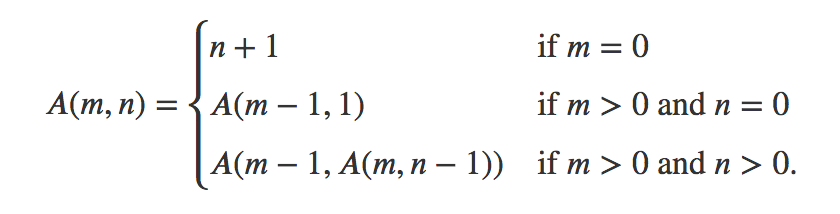

# Programsko inženjerstvo - Vježbe

## 3. Funkcije

_(prilagođeno prema knjizi Eloquent Javascript)_

Funkcija je osnovni gradivni element Javascript programa. Koncept pridruživanja dijela programa određenom nazivu (varijabli) ima višestruku primjenu: a) daje strukturu većim programima, b) smanjuje ponavljanje koda, c) pridružuje nazivlje potprogramima i d) izolira međusobno potprograme od neželjenih utjecaja. 

### Definiranje funkcije

Definicija funkcije je pridruživanje Javascript koda varijabli. Primjer:

```javascript
const kvadriraj = function(x) {
  return x*x;
}

let a = kvadriraj(12);
console.log(a) /* → 144 */
```

U ovom slučaju kod koji je omotan kvadrira argument funkcije i vraća ga natrag pozivatelju. Funkcija može imati više parametara, ali niti ne mora imati parametre. Također, može i ne mora vratiti vrijednost. Ukoliko vraća vrijednost čini to pomoću ključne riječi `return`. Primjer:

```javascript
const ispisi = function() {
  console.log("Živ sam!");
}

ispisi();
```

U ovom slučaju funkcija `ispisi` ne vraća nikakvu povratnu vrijednost, ali izvršava određenu radnju.

Svako pridruživanje vrijednosti ili funkcije varijabli ima određenu vidljivost (engl. _scope_), odnosno dio koda u kojem je određena varijabla dostupna. Ukoliko se pridruživanje nalazi izvan funkcije ili bloka koda omeđenog vitičastim zagradama (`{` i `}`), kažemo da je njegova vidljivost globalna, odnosno dostupna u cijelom programu.

Pridruživanja inicijalizirana sa `let` i `const` vidljiva su samo unutar bloka u kojem su inicijalizirane, dok su varijable inicijalizirane pomoću ključne riječi `var` vidljive cijeloj funkciji ili programu (ukoliko nisu unutar funkcije). Primjer:

```javascript
let x = 10;
if (true) {
  let y = 20;
  var z = 30;
  console.log(x + y + z);
}
console.log(x + z); /* z je vidljiv jer je inicijaliziran pomoću var */
```

**Pažnja!** Neobična stvar Javascripta je da su u svakom blok dostupne varijable definirane u prethodnom bloku (ukoliko su različitog imena).

Primjer:

```javascript
const halve = function(n) {
  return n / 2; /* n je iz vanjskog bloka!! */
};

let n = 10;
console.log(halve(100));
/* → 50 */
console.log(n);
/*  → 10
```

**Ugnježdeni blokovi**. Moguće je ugnijezditi i blokove unutar blokova. U svakom su bloku vidljive varijable definirane u tom bloku te dodatno, varijable iz bloka koji mu je roditelj. Iznimka su globalne varijable koje su definirane u glavnom programu (bloku) izvan funkcija. One su vidljive svugdje nevezano uz razinu ugnježdenosti bloka. Primjer:

```javascript
const mix = function(udio) {
  const sastojak = function(kolicina, mjera, naziv) {
    let stvarnaKolicina = kolicina * udio;
    console.log(`${bullet} ${stvarnaKolicina} ${mjera} ${naziv}`);
  };
  sastojak(1, "limenka", "ananasa");
  sastojak(0.25, "šalica", "šećera");
  sastojak(0.25, "šalica", "limunovog soka");
};

var bullet = " * ";
mix(0.5);
mix(0.1);
```

Unutar funkcije `sastojak` vidljiva je varijabla `udio`, ali i globalna varijabla `bullet`.

### Deklaracija funkcije

Uz standardni način definiranja funkcije gdje se ona pridružuje varijabli, moguće je i skraćeno deklarirati funkciju:

```javascript
var a = kvadriraj(5);

function kvadriraj(x) {
  return x*x;
}
```

U ovom slučaju ta se deklaracija prevodi prije početka izvršavanja programa pa je moguće funkciju pozvati čak i prije nego što je ona definirana.

### "Arrow" funkcije

Treći način definiranje funkcija još je u skraćenijem obliku. Umjesto ključne riječi `function` moguće je koristiti `=>` (znak `=` i `>` zajedno).

Primjer:

```javascript
const potenciraj = (baza, eksponent) => {
  let rezultat = 1;
  for (let brojac = 0; brojac < eksponent; brojac++) {
    rezultat *= baza;
  }
  return rezultat;
};
console.log( potenciraj(2, 4) );
```

Prvo se navode parametri u zagradama, zatim simbol `=>` nakon čega slijedi tijelo funkcije.

Ukoliko postoji samo jedan parametar nije ga potrebno omotati zagradama, te ukoliko funkcija sadrži samo jednu liniju, nije potrebno navoditi `return`. Primjerice:

```javascript
const kvadrat = (x) => { return x*x }; // dulji oblik
const kvadrat_jos_krace = x => x * x; // kraći oblik
```

Ukoliko nema parametra, potrebno je proslijediti prazne zagrade:

```javascript
const javise = () => {
  console.log("Hello!");
}
```

### Opcionalni argumenti funkcije

Ukoliko funkciji predamo više argumenata od onoga što ona ima definirano, oni su jednostavno ignorirani. Primjerice:

```javascript
function kvadriraj(x) { return x * x; }
console.log(kvadriraj(4, true, "nesto_trece"));
// → 16
```

Vrijedi i obrnuto, ukoliko funkcija sadrži više parametara od broja paramatera koji su proslijeđeni u pozivu, oni će biti `undefined`. Primjer:

```javascript
function minus(a, b) {
  if (b === undefined) return -a;
  else return a - b;
}

console.log(minus(10));
// → -10
console.log(minus(10, 5));
// → 5
```

Možemo postaviti i _default_ vrijednost parametara:

```javascript
function potenciraj(baza, eksponent = 2) {
  let rezultat = 1;
  for (let brojac = 0; brojac < eksponent; brojac++) {
    rezultat *= baza;
  }
  return rezultat;
}

console.log(potenciraj(4));
// → 16
console.log(potenciraj(2, 6));
// → 64
```


## Zadaci za vježbu

1. **(JS-301)** Napisati funkciju `min` koja prima dva argumenta i vraća natrag manjeg.

   ```javascript
   // napisati funkciju `min`
   
   console.log(min(0, 4)) // → 0
   console.log(min(0, -4)) // → -4
   ```

1. **(JS-302)** Napisati funkciju koja prima `string` i vraća najveći broj uzastopno istih znakova u tom stringu. 

   ```javascript
   // napisati funkciju `isti_znakovi`
   
   console.log(istiZnakovi("baaaccd")) // → 3
   console.log(istiZnakovi("ba2dll")) // → 2
   ```

3. **(JS-303)** Implementirati Ackermann-ovu funkciju:
   

   ```javascript
   // napisati funkciju ackermann
   
   console.log(ackermann(0, 5)) // → 6
   console.log(ackermann(5, 0)) // → 65533
   console.log(ackermann(3, 6)) // → 509
   console.log(ackermann(3, 3)) // → 61
   ```

   

