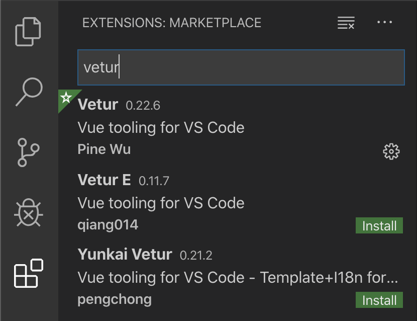

# Vue.js - Postavljanje aplikacije

U ovoj vježbi instalirati ćemo sve potrebne preduvjete za kreiranje aplikacije u Vue.js okviru te postaviti temelje za kreiranje registracije i  prijave u aplikaciju.

## Koraci

1. Instalirati **node.js** (https://nodejs.org/) i provjeriti jeli instaliran s naredbom `npm -v`u Command Promptu.

1. Instalirati **yarn** (opcionalno): https://yarnpkg.com/lang/en/docs/install/

1. Instalirati **vue.js** kroz *Command Prompt* i provjeriti jel instaliran sa `vue -V`

   ```bash
   npm i -g @vue/cli
   
   vue -V
   # @vue/cli 4.0.5 (moguće je da kod tebe bude drugačija verzija)
   ```

1. Navigirati u folder u kojem želimo da se nalazi novi projekt. Kreirati novi Vue projekt pomoću naredbe (projekt ćemo nazavti `fipugram`):

  ```bash
  vue create fipugram
  
  # 1. Odabrati "Manually select features"
  # 2. Označiti Babel, Router, i CSS Pre-processors
  # 3. Na ostala pitanja samo lupiti <enter>
  ```

  **Kratko pojašnjenje**: *Babel* je prevoditelj koji omogućuje da suvremenije verzije JS sintakse rade na starijim preglednicima. *Router* podešava node.js ruter za navigaciju u single-page aplikacijama. CSS pre-processor nam omogućuje da pišemo u aplikaciji SCSS (naprednija inačica CSS-a - https://sass-lang.com/).

  

1. Kada je osnovni kostur projekta kreiran, potrebno je navigirati u direktorij projekta i pokrenuti aplikaciju:

   ```bash
   cd fipugram
   npm run serve
   ```

   Time se aplikacija pokreće i možemo ju otvoriti na ispisanoj adresi. Aplikacija se automatski osvježava kada promijenimo i snimimo bilo koju datoteku projekta. Izvođenje aplikacije možemo zaustaviti za <CTRL+C> kombinacijom tipki.

1. Instalirati **Visual Studio Code** te dodatno u njemu instalirati paket za lakše kodiranje Vue.js aplikacija `Vetur`.




<center>*Slika 1. Instalacija `Vetur` plugina za Visual Studio Code.*</center>

1. Ajmo sada napraviti **Login stranicu**. Pretvorit ćemo postojeću `About` stranicu koja dolazi sa praznim projektom u `Login` stranicu na način da ćemo:

   * preimenovati datoteku koja sadrži tu stranicu u direktoriju `view`sa `About.vue` u `Login.vue`,

   * promijeniti postavku u ruteru `router/index.js`, odnosno objekt u polju `routes` čiji `path` je `/about` da odgovara novom URL-u i novoj komponenti `Login.vue`:

     ```javascript
     {
       path: '/login',
       name: 'login',
       // ...
       component: () => import(/* webpackChunkName: "login" */ '../views/Login.vue')
     }
     ```

   * promijeniti link na glavnoj stranici `App.vue` da se zove "Login" i da vodi na `/login`:

     ```xml
       <div id="app">
         <div id="nav">
           <router-link to="/">Home</router-link> |
           <router-link to="/login">Login</router-link>
         </div>
         <router-view/>
       </div>
     ```

   

1. Stilizirati `Login.vue` stranicu na način da uključuje `<input/>` polja za login i password.
   Preporuča se koristiti Boostrap grid (https://getbootstrap.com/docs/4.0/layout/grid/) s tri stupca te formu (https://getbootstrap.com/docs/4.0/components/forms/) smjestiti u središnji stupac grida da bude centriran.

   > :warning: Da bi Boostrap radio moramo dodati link na CSS u `<head>`sekciju glavnog (i jedinog) HTML dokumenta `public/index.html`. Pogledaj https://getbootstrap.com/docs/4.0/getting-started/introduction/

   Primjerice, možemo urediti stranicu kao na Slici 2. 

   ```html
   <template>
     <div class="about">
       <h1>This is an login page</h1>
       <div class="container">
         <div class="row">
           <div class="col-sm"></div>
           <div class="col-sm">
             <form>
               <div class="form-group">
                 <label for="exampleInputEmail1">Email address</label>
                 <input type="email" class="form-control" id="exampleInputEmail1" aria-describedby="emailHelp" placeholder="Enter email" />
                 <small id="emailHelp" class="form-text text-muted" >We'll never share your email with anyone else.</small>
               </div>
               <div class="form-group">
                 <label for="exampleInputPassword1">Password</label>
                 <input type="password" class="form-control" id="exampleInputPassword1" placeholder="Password" />
               </div>
               <button type="submit" class="btn btn-primary">Submit</button>
             </form>
           </div>
           <div class="col-sm"></div>
         </div>
       </div>
     </div>
   </template>
   ```

   *Slika 2: primjer kako može izgledati `Login.vue`stranica.*

   

1. Po uzoru na Login stranicu dodati novu **Signup** stranicu:

   * Dodati novu datoteku `views/Signup.vue`
   * Dodati novo pravilo u ruter `router/index.js`
   * Dodati novi link za registraciju na `App.vue`
   * Urediti formu na `Signup.vue` da uključuje sva potrebna polja za registraciju

1. Dodati bootstrap jumbotron na `Home.vue`(https://getbootstrap.com/docs/4.0/components/jumbotron/) ili urediti po želji.
