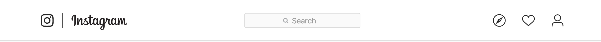
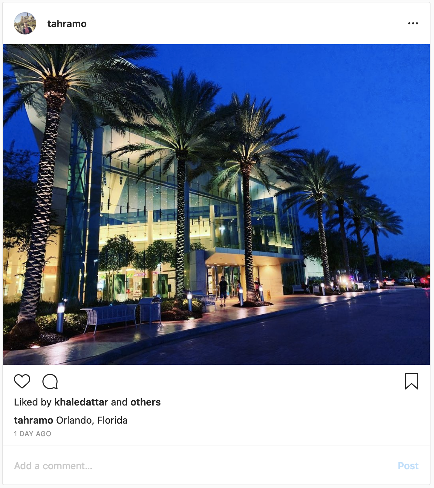
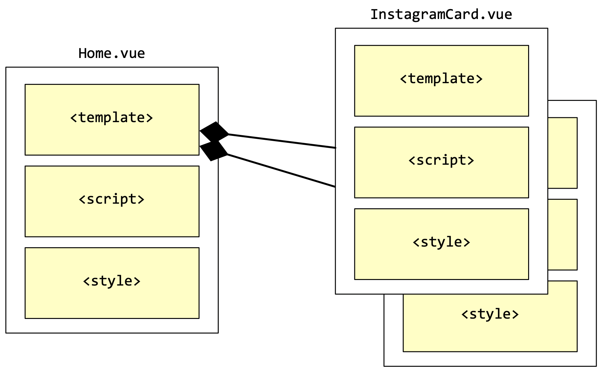

# Vue.js - Uređivanje početne stranice

U ovoj vježbi prilagodit ćemo izgled početne stranice aplikacije i izvdojiti Instagram post u zasebnu komponentu.

## Koraci

Kod sa prethodnih VUE-01 vježbi možemo pruezeti s GitHuba. Repozitorij: https://github.com/fipu-nastava/fipugram (branch `step1`). Za preuzimanje je potrebno instalirati Git klijent (za konzolu) ili GitHub Desktop aplikaciju.

> ⚠️ Dalje slijede upute preko komandne linije i Git klijenta

1. Otvorimo konzolu i sa `cd` naredbom navigiramo u željeni direktorij gdje želimo preuzeti prethodni projekt.

1. Naredba za preuzimanje sa GitHuba glasi: `git clone https://github.com/fipu-nastava/fipugram.git`nakon čega ulazimo u novokreirani direktorij sa `cd fipugram`.

1. Moduli iz `npm`a ne dolaze s GitHuba, ali su definirani u datoteci `package.json` pa ih možemo instalirati i pokrenuti aplikaciju:

   ```bash
   npm install
   npm run serve
   ```

   > :warning: Za sljedeće upute potrebno je ručno pretražiti Bootstrap stranice i oblikovati željeni izgled. Upute su okvirne.

5. Potrebno je oblikovati zaglavlje aplikacije da nalikuje Instagramu. Ključni elementi (za sada) su logotip i polje za pretragu. Logotip Instagrama je `<svg>`element (https://en.wikipedia.org/wiki/Scalable_Vector_Graphics).

   
   Slika 1. Izgled Instagram zaglavlja

5. Potrebno je oblikovati ostatak `Home.vue` komponente da ima dva stupca. To možemo učiniti koristeći Grid layout koji podržava do 12 kolona. Primjer:

   ```html
   <template>
     <div class="row">
       <div class="col-1"></div>
       <div class="col-7">
         ... ovdje ide Instagram story!
       </div>
       <div class="col-3">
         ... ovdje ide desni stupac!
       </div>
     </div>
   </template>
   ```

   

5. Potrebno je oblikovati barem jednu Instagram objavu. Ključni elementi su zaglavlje objave s autorom, slika, te prostor za unos komentara. Sliku možemo proizvoljno odabrati ili učitati sa https://unsplash.com/. Fotografiju možemo smjestiti u `public`direktorij, a prikazati ju sljedećim HTML kodom:

   ```html
   
   ```

   

   
   Slika 2. Izgled Instagram objave

   

8. Zatim je potrebno izvući Instagram objavu u novu komponentu. Možemo iskoristiti postojeću `HelloWorld.vue` komponentu iz direktorija `components`. Potrebno je:

   - Smjestiti HTML kod objave u `<template>`komponente `HelloWorld.vue` i preimenovati naziv komponente u svojstvu `name`:

     ```html
     <template>
     
           <div class="card">
             <div class="card-header text-left">
               Featured
             </div>
             <div class="card-body p-0">
               
             </div>
             <div class="card-footer text-muted text-left">
               2 days ago
             </div>
           </div>
     
     </template>
     
     <script>
     export default {
       name: 'InstagramCard',
       props: {
         msg: String
       }
     }
     </script>
     ```

     Slika 3. Primjer kako može izgledati `Instagram.vue`

   - Preimenovati datoteku u `InstagramCard.vue`

   - Uključiti `InstagramCard` u `Home.vue`umjesto `HelloWorld.vue` te umjesto prethodnog koda pozvati `<InstagramCard/>`:

     ```html
     <template>
       <div class="row">
         <div class="col-1"></div>
         <div class="col-7">
     
           <InstagramCard />
     
         </div>
         <div class="col-3">
           Ovdje ide sidebar
         </div>
       </div>
     </template>
     
     <script>
     // @ is an alias to /src
     import InstagramCard from '@/components/InstagramCard.vue'
     export default {
       name: 'home',
       components: {
         InstagramCard
       }
     }
     </script>
     
     <style lang="scss">
       .card {
         margin-bottom: 20px;
       }
     </style>
     ```

     Slika 4. Primjer kako može izgledati `Home.vue`
     
     Slika 5. Vizualni prikaz kompozocije komponenti.
     

9. Oblikovati ostatak početne stranice da nalikuje na Instagram:
   * Ikonice uz objavu
   * Nekoliko *Stories* u desnom stupcu.
   * Nekoliko *Suggestions for you*
9. Izdvojiti *Stories*i *Suggestions for you* u zasebne komponente po uzoru na `InstagramCard.vue`