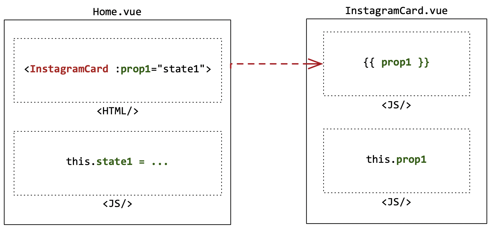
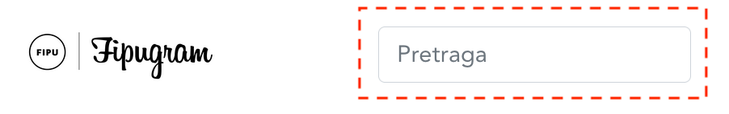
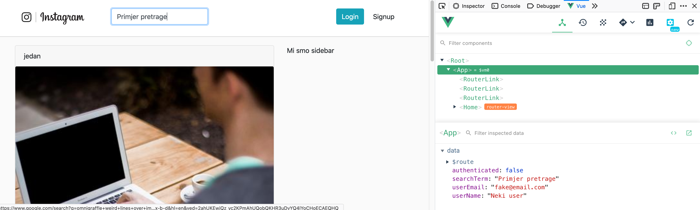

# Vue.js - Podaci i Komponente

U ovoj vježbi prikazivat ćemo Instaclone postove zavisno o zasebno definiranim podacima. Zatim ćemo izdvojeni Instaclone post u komponenti `InstagramCard` nadopuniti s parametrima.

## Koraci

1. Kod sa prethodnih VUE-02 vježbi možemo pruezti s GitHuba. Repozitorij: https://github.com/fipunastava/fipugram (branch `step2`). Preuzimanje s Git-a, instaliranje paketa i pokretanje aplikaicije pojašnjeno je u prethodnim vježbama.
  
2. Primjetimo kako u komponenti `Home.vue` koristimo dvaput komponentu `InstagramCard` te se ona dvaput prikazuje na aplikaciji (`http://localhost:8080/`):

   ```html
   <template>
     <div class="row">
       <div class="col-8">
         <instagram-card />
         <instagram-card />
       </div>
       <div class="col-4">
         Sidebar
       </div>
     </div>
   </template>
   ```

   

   Ukoliko želimo komponentu prikazati više puta možemo koristiti `v-for` modifikator Vue.js-a (dokumentacija: https://vuejs.org/v2/guide/list.html). `v-for` (`v` kao Vue, `for` kao petlja) služi za iteraciju kroz JavaScript `Array`. Potrebno je definirati polje koje ćemo prikazivati u `<script>` djelu komponente `Home.vue`. Neka taj `Array` sadrži nekoliko `url`-ova slika s Interneta. U postojeći JavaScript objekt koji se postavlja kroz `export default` u `Home.vue` dodajemo `data` metodu koja će vratiti objekt s podacima (ključevi tog objekta koriste se u `<template>` dijelu: 

   ```javascript
   export default {
     ...
     data() { // skraćeno od "data: function() {"
       return {
         cards: [
           "https://picsum.photos/id/1/400/400",
           "https://picsum.photos/id/2/400/400",
           "https://picsum.photos/id/3/400/400"
         ]
       }
     },
     ...
   }
   ```

   Na aplikaciji još uvijek nema promjene jer moramo `v-for` petlju postaviti na `InstagramCard` komponentu i namjestiti da preuzima polje iz `cards` polja u `data` metodi (`data` metoda postavlja sve što želimo da bude vidljivo u `<template>`dijelu komponente):

   ```html
   ...
   	<InstagramCard v-for="url in cards"/>
   ...
   ```

   Sada je dovoljno samo jednom pozvati `InstagramCard` komponentu jer se kroz `v-for` atribut ponavlja onoliko puta koliko je elemenata u polju`cards`. No uvijek se prikazuje ista slika? I to nije ona slika sa `URL`-a u `cards`. Zapravo `InstagramCard` komponenta nema informaciju iz trenutne komponente `Home.vue` o tome koju sliku treba prikazivati. Jedino što smo rekli jest da se ponavlja `cards.length` puta. Potrebno je komponenti proslijediti informaciju o slici.

   Tome služe **svojstva** (engl. property) Vue komponenti. Analogija je slična kao kada funkciji ili metodi definiramo da ima parametar, a onda taj parametar pri pozivu funkcije proslijeđujemo. Primjer (nije vezano uz Instaclone projekt) kako bi to analogno izgledalo u običnom JavaScriptu (bez Vue.js i bez grafičkog sučelja):

   ```javascript
   // zamisli kao da je ovo InstagramCard komponenta
   function InstagramCard(info) {
     console.log(info);
   }
   
   // zamisli kao da je ovo data() dio iz <script> u Home.vue
   let cards = cards: [
     "https://picsum.photos/id/1/400/400",
     "https://picsum.photos/id/2/400/400",
     "https://picsum.photos/id/3/400/400"
   ]
   
   // zamisli kao da je ovo <template> dio u Home.vue
   for (let card of cards) {
   	InstagramCard(card); 
   }
   ```

   

   OK, sada kada nam je metafora zašto nam trebaju komponente i svojstva jasnija (još jednom: jer sliče funkcijama i parametrima, ali za oblikovanje grafičkog sučelja) potrebno je definirati da komponenta `InstagramCard` prima svojstvo `info`(možemo ga nazvati kako želimo). To ćemo učiniti u `InstagramCard.vue` datoteci na način da dodamo `<script>` dio:

   ```html
   <script>
   export default {
     props: ["info"]
   }
   </script>
   ```

   Još uvijek se ne prikazuju slike jer nismo navedeni podatak smjestili u `` element koji se nalazi u `<template>` dijelu i nismo proslijedili tu informaciju proslijedili u `v-for`petlji u `Home.vue` dijelu:

   ```html
   <template>
   ...
     	<InstagramCard v-for="card in cards" :info="card"/>
   ...
   </template>
   ```

   Home.vue

   

   ```html
   <template>
   ...
     	
   ...
   </template>
   ```

   InstagramCard.vue

   Primijetimo bitnu razliku u atributima `info` i `src` u odnosu na klasične HTML atribute, a to je da ispred njih stoji znak `:` koja označava *bind*-anje atribute na JavaScript varijablu ili složeniji izraz. Oznaka `:`skraćena je od `v-bind:` i može se staviti ispred bilo kojeg klasičnog HTML atributa (npr. `src` u `img`) ili Vue svojstva (npr. `info` u `InstagramCard`). `v-bind:` označava da se parametar kojeg predajemo ne predaje kao običan `String` nego da je riječ o JavaScript varijabli ili složenijem izrazu. O ovom slučaju želimo da se u `:info` kod `InstagramCard` proslijedi `card` varijable iz `v-for` petlje, te u `:src` kod `img` elementa proslijedi svojstvo `info`koji je definiran u toj komponenti i dolazi izvana iz varijable `card`.

   

3. Primijenili smo `v-for` petlju koja je rezultirala time da imamo slike koje zaista dolaze iz `cards`polja. Potrebno je uz te slike (njihove `url`ove) predati i dodatne informacije poput naslova uz sliku i vremena kada je slika objavljena. Želimo da naš `cards` izgleda kao lista objekata:

   ```javascript
   cards: [
     { title: 'jedan', time: 'an hour ago', url: 'https://picsum.photos/id/1/400/400' },
     { title: 'dva', time: '2 days ago', url: 'https://picsum.photos/id/2/400/400' },
   ]   
   ```

   Zamijenili smo polje `Stringova` sa poljem `Object`a gdje svaki `Object` ima ključeve `title`, `time` i `url`.

   U skladu s time potrebno je modificirati `<template>`dio u `InstagramCard.vue`:

   ```html
   <template>
         <div class="card text-center">
           <div class="card-header text-left">
             {{ info.title }}
           </div>
           <div class="card-body">
             
           </div>
           <div class="card-footer text-left">
             {{ info.time }}
           </div>
         </div>
   </template>
   ```

   U ovom smo slučaju za `title` i `time`umjesto `v-bind:` (skraćeno `:`) koristili interpolaciju (znakovi `{{`i `}}`) koja na željeno mjesto u HTML kodu ispisuje vrijednost JavaScript varijable ili izraza (npr. možemo probati i sljedeće: `{{ 2 + 2 + nekirezultat()}}`).

   
   Slika 5. Prikaz proslijeđivanja svojstava u komponente

3. Instaclone kartice sada su kompletne (prikazuju naslov, ispravnu sliku i vrijeme), a sljedeći korak je realizacija funkcionalnosti pretrage. To ćemo učiniti preko `<input>` elementa u zaglavlju aplikacije definiranog u `App.vue`:
   
   
   **Slika**: input polje koje ćemo iskoristiti za search.


   Za razliku od `v-bind` pomoću kojega možemo vrijednost JavaScript varijabli prikazivati u HTML elementima, pomoću `v-model` možemo ostvariti dvostranu vezu: promjenom JS varijable mijenja se sadržaj HTML elemente te obratno, kada korisnik promijeni sadržaj HTML elementa, promijeni se sadržaj JS varijable. `v-model`koristimo nad sljedećim HTML elementima: `<input>`, `<textarea>`, `<input type="checkbox">`, `<input type="radio">`, `select`. Sve redom HTML elementi koji zaprimaju podatke unesene od strane korisnika aplikacije.

   Kako bi ostvarili `v-model` povezivanje prvo moramo definirati VUE JavaScript varijablu unutar `data`ključa komponente koji trenutno izgleda ovako:

   ```javascript
   import store from '@/store.js'
   
   export default {
     data () {
       return store;
     }
   }
   ```

   Kao `data` ključ koristi se anonimna metoda koja vraća `store`objekt iz `store.js` JavaScript modula. Samim time definirat ćemo novu `searchTerm` varijablu unutar `store.js` i bit će dostupna i u `App.vue` (primjetimo `import store from '@/store.js'`). Dodajemo `searchTerm` u `store.js`:

   ```javascript
   export default {
       searchTerm: ''
   }
   ```

   Zatim dodajemo `v-model` na polje za pretragu i povezujemo ga sa JavaScript varijablom `searchTerm`:

   ```html
   <input v-model="searchTerm" class="form-control mr-sm-2" type="search" placeholder="Search" aria-label="Search">
   ```

   Sada možemo primjetiti da se korisnički uneseni tekst povezuje sa `searchTerm` varijablom iz `App.vue` komponente:
   
   **Slika:** Pomoću plugina Vue DevTools možemo vidjeti sinkronizaciju između teksta u Vue komponenti i input polju.


   Sljedeći korak je implementacija filtriranja Instaclone postova prema unesenom tekstu. To možemo realizirati na način da filtriramo polje `cards` samo sa onim karticama čiji naslov uključuje `searchTerm`. Zatim ćemo `v-for` petlju usmjeriti prema filtriranom polju. Kada imamo potrebu prikazati nekakvu modifikaciju originalnog podatka iz `data` dijela, možemo koristiti `computed` dio pri definiciji Vue komponente. Prvo ćemo napraviti novu `computed` metodu `filteredCards()` koja će vratiti filtrirane kartice:

   ```javascript
   import InstagramCard from '@/components/InstagramCard.vue'
   import store from '@/store.js'
   
   export default {
     name: 'home',
     data() {
       return {
         cards: [
           { title: 'jedan', time: 'an hour ago', url: 'https://picsum.photos/id/1/400/400' },
           { title: 'dva', time: '2 days ago', url: 'https://picsum.photos/id/2/400/400' },
         ]
       }
     },
     computed: {
       filteredCards() {
         return this.cards.filter(card => card.title.includes(store.searchTerm))
       }
     },
     components: {
       InstagramCard
     }
   }
   ```

   Nakon čega možemo zamijeniti `v-for` petlju koja prikazuje kartice da ih čita pomoću nove `computed` metode:

   ```html
   ...
         <InstagramCard v-for="card in filteredCards" :info="card"/>
   ...
   ```

   Vue sam brine o tome kada treba nanovo pozvati metodu `filteredCards` i prikazati novi set kartica.

3. **Samostalni zadatak**: Potrebno na proizvoljno mjestu u Instaclone post dodati podatak o korisniku vlasniku posta. Zatim je potrebno modificirati pretragu na način da pretražuje i po naslovu i po korisniku (što god zadovolji pretragu). Zadaću uploadati pod VUE-03 šifrom na dogovoreno mjesto za predaju zadaće.  