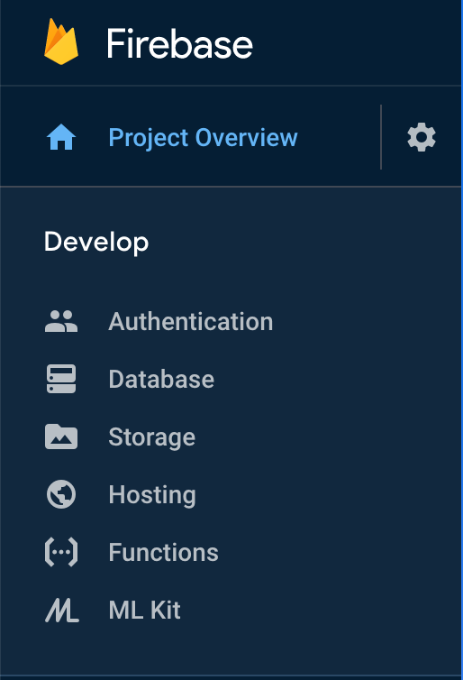
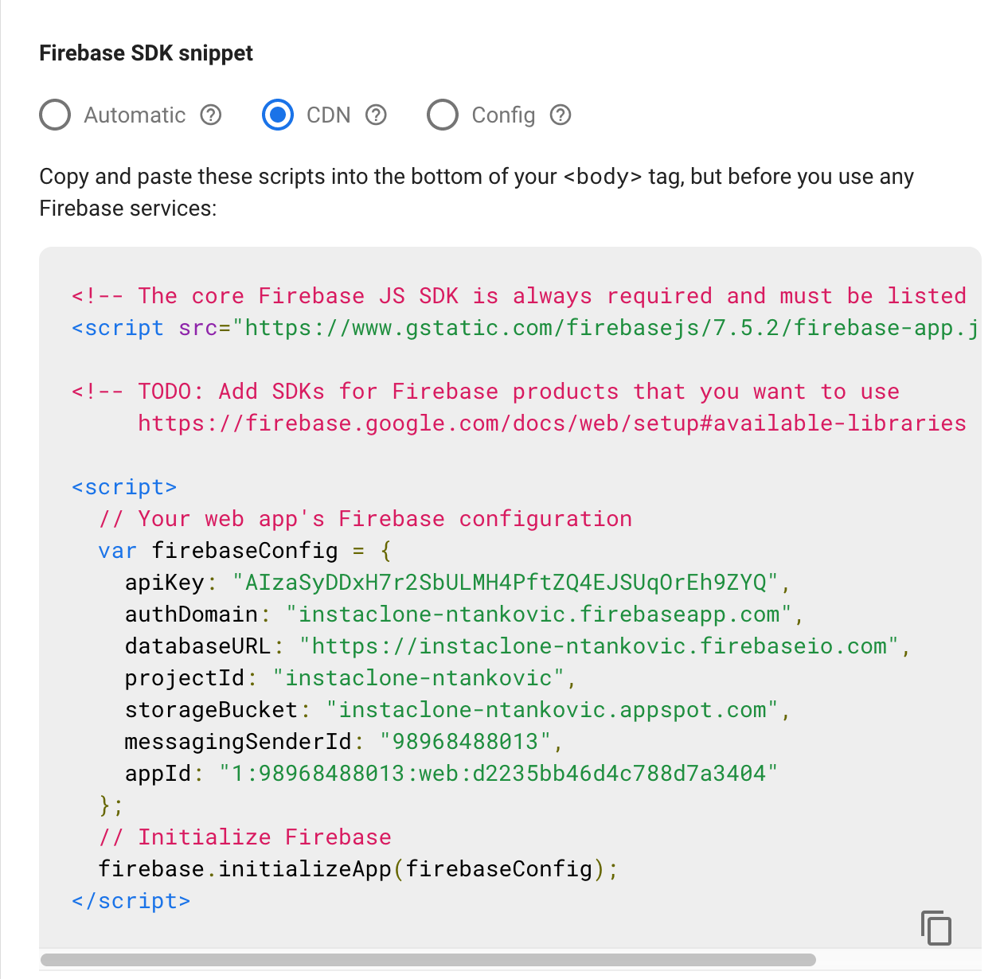
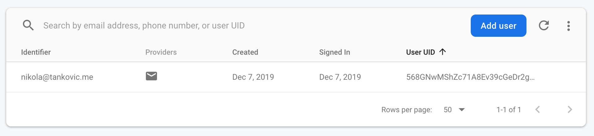

# Vue.js - Autentifikacija

U ovoj vježbi prikazivat ćemo jedan od načina na koji se može ostvariti autentifikacija u aplikaciji. Pritom ćemo koristiti Firebase bazu i JS pakete.

## Koraci

1. Kod sa prethodnih VUE-03 vježbi možemo pruezti s GitHuba. Repozitorij: https://github.com/dbulic/instaclone (branch `plan-wk3`). Preuzimanje s Git-a, instaliranje paketa i pokretanje aplikaicije pojašnjeno je u prethodnim vježbama.

1. Za korištenje Firebase-a u JavaScript/Vue aplikacije potrebno je uključiti Firebase skripte. Skripte za zaglavlje možemo pronaći u Firebase dokuemntaciji (From the CDN dio): https://firebase.google.com/docs/web/setup#add-sdks-initialize
   Dodati ćemo ih na dno `body` elementa u`index.html`datoteku ispod `<div id="app"></div>`:

   ```html
   ...
       <div id="app"></div>
   
       <!-- Firebase App (the core Firebase SDK) is always required and must be listed first -->
       <script src="https://www.gstatic.com/firebasejs/7.5.2/firebase-app.js"></script>
       
       <!-- If you enabled Analytics in your project, add the Firebase SDK for Analytics -->
       <script src="https://www.gstatic.com/firebasejs/7.5.2/firebase-analytics.js"></script>
       
       <!-- Add Firebase products that you want to use -->
       <script src="https://www.gstatic.com/firebasejs/7.5.2/firebase-auth.js"></script>
       <script src="https://www.gstatic.com/firebasejs/7.5.2/firebase-firestore.js"></script>
   
     </body>
   </html>
   ```

3. Time smo uključili potrebne `firebase`JavaScripte objekte u svoju aplikaciju. U ovom koraku otvorit ćemo novi Firebase račun (ukoliko ga već nemamo). Potrebno je izvršiti registraciju na https://firebase.google.com i ulogirati se na administracijsku konzolu: https://console.firebase.google.com/u/0/ i stvoriti novi Firebase projekt (nije nužno uključiti Firebase analytics).

3. Otvori svoj Firebase projekt i sa izbornika odaberi **Authentication**. Zatim odaberi **Set up sign-in method** i uključi (**Enable**) Email/Password način logina (za svoj projekt možeš podesiti i različite oblike logina poput Google ili Facebook logina).

   
   **Slika 1.**Izbornik Firebase konzole.

3. Još je potrebno u Vue projektu postaviti da se spaja na naš Firebase projekt. Do sada smo samo uključili Firebase biblioteke i omogućili autentifikaciju preko emaila i šifre. Podatke za spajanje na Firebase projekt možemo naći u Firebase konzoli u postavkama projekta (klik na zupčanik na izborniku) u sekciji **Firebabse SDK snippet** i podsekciji **CDN** (ili **Config**).
   
   **Slika 2.** Primjer Firebase konfiguracije.

   Navedenu konfiguraciju kopiramo i smjestim na dno `<body> `elementa u `index.html` datoteku unutar novog `<script>` HTML elementa.

3. Time je naša aplikacija povezana sa Firebaseom i možemo napraviti mogućnost registracije pomoću komponente `Signup.vue`. Prvo ćemo definirati Vue varijable za Email i dvije lozinke u `Signup.vue`:

   ```html
   <script>
   export default {
     data() {
       return {
         email: "",
         password: "",
         passwordAgain: ""
       }
     }
   }
   </script>
   ```

   Zatim ćemo povezati navedene varijable sa `v-model`na odgovarajuća `input`polja u `<template>` sekciji:

   ```html
   <form>
           <div class="form-group">
             <label for="emailField">Email address</label>
             <input v-model="email" type="email" class="form-control" id="emailField" aria-describedby="emailHelp" placeholder="Enter email">
             <small id="emailHelp" class="form-text text-muted">We'll never share ...</small>
           </div>
           <div class="form-group">
             <label for="passwordField">Password</label>
             <input v-model="password" type="password" class="form-control" id="passwordField" placeholder="Password">
           </div>
           <div class="form-group">
             <label for="confirmPasswordField">Confirm Password</label>
             <input v-model="passwordAgain" type="password" class="form-control" id="confirmPasswordField" placeholder="Confirm password">
           </div>
           <button type="submit" class="btn btn-primary mt-5">Sign up</button>
         </form>
   ```

   Potrebna nam je i nova metoda koja će učitati utipkane podatke i pozvati Firebase metodu za registraciju. Dodat ćemo je u `methods` sekciju:

   ```javascript
   export default {
     name: "signup",
     data() {
       return {
         email: "",
         password: "",
         passwordAgain: ""
       }
     },
     methods: {
       signup() {
         firebase.auth().createUserWithEmailAndPassword(this.email, this.password).catch(function(error) {
           console.log(error);
         });
       }
     }
   }
   ```

   Namjestit ćemo da se navedena metoda poziva prilikom *submita forme* (`<template>` dio u `Signup.vue`):

   ```html
   ...
   <form @submit.prevent="signup">
     ...
   ```

   Ukoliko je sve u redu trebali bi se moći registrirati i vidjeti novoga korisnika u Firebase konzoli (sekcija Authentication):

   

   

3. Na sličan način podesiti `Login.vue` komponentu. Potrebno je umjesto Firebase metode za *sign-up* koristiti metodu za *sign-in*. Možeš ju pronaći u Firebase dokumentaciji :)
   P.S. Razmisli jesu li potrebni baš identične varijable u `data` sekciji.

3. Registracija i Login sada rade. Međutim aplikacija je isto nezavisno o tome jeli trenutni korisnik ulogiran ili ne. U ovom ćemo koraku:

   * razlikovati kada je korisnik ulogiran i prema tome prikazati ili sakriti određene dijelove (npr. Login button),
   * nakon *logina* ili *logouta*preusmjeriti korisnika na `/home` ili `/login`.

   Da bi pratili stanje autentifikacije korisnika moramo dodati tzv. *listener*koji reagira na promjenu stanja autentifikacije (https://firebase.google.com/docs/reference/js/firebase.auth.Auth.html#onauthstatechanged).

   U glavnu komponentu `App.vue` dodajemo sljedeći isječak:

   ``` javascript
   firebase.auth().onAuthStateChanged(user => {
     if (user) {
       // User is signed in.
       console.log(user.email);
     }
     else {
       // User is not signed in.
       console.log("No user");
     }
   });
   ```

   U `store.js` već imamo varijablu `authenticated`pomoću koje prikazujemo/sakrivamo *button*Login/Logout. Podesi `store.authenticated` na `true/false` zavisno o stanju autentifikacije u gornjem isječku. Također, u slučaju autentificiranog korisnika podesi `store.userEmail` na e-mail korisnika.

   > :warning: **Razmisli**: zašto smo praćenje autentifikacije dodali u `App.vue`, a ne recimo u `Login.vue`?

   Još je potrebno napraviti *logout* akciju. Već imamo `logout` metodu u koju treba pozvati `Firebase` metodu za logout. Pronađi ju u dokumentaciji i zamijeni kod u postojećoj metodi. Zašto nije potrebno ostaviti `store.authenticated = false`?

9. U zadnjem korako dodat ćemo još redirekciju nakon logina i logouta. Razmisli gdje ćeš dodati sljedeće naredbe za redirekciju na `/login` stranicu i redirekciju na `/` (Home) stranicu:

   ```javascript
   // redirekcija na "home" stranicu (naziv stranice "home" definiran je u routes/index.js)
   if (this.$route.name !== 'home')
     this.$router.push({name: 'home'})
   
   // redirekcija na "login" stranicu
   if (this.$route.name !== 'login')
     this.$router.push({name: 'login'})
   ```

9. **Samostalni zadatak.** Provjeriti jesu li dvije lozinke iste pri registraciji. Napraviti novu stranicu postavki korisnika. Na toj stranici omogućiti korisniku promjenu lozinke. Zadatak predati na predviđeno mjesto pod šifrom VUE-04. 

