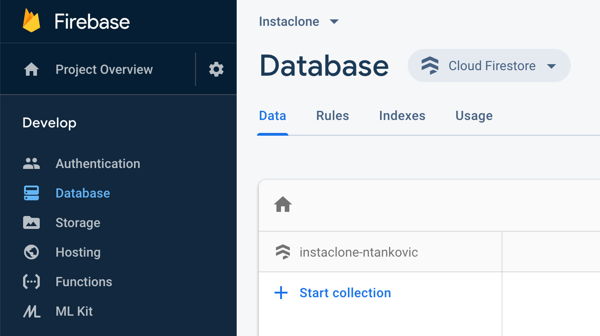

# Vue.js - Cloud Firestore

U ovoj vježbi prikazivat ćemo integraciju Firebase baze (Cloud Firestore).

## Koraci

1. Kod sa prethodnih VUE-04 vježbi možemo preuzti s GitHuba. Repozitorij: https://github.com/dbulic/instaclone (branch `plan-wk4`). Preuzimanje s Git-a, instaliranje paketa i pokretanje aplikaciije pojašnjeno je u prethodnim vježbama.

1. Usluzi Firebase baze pristupa se pomoću Firebase web konzole (https://console.firebase.google.com/). Potrebno je pristupiti projektu te u sklopu njega uslugu `Database` i to specifično `Cloud Firestore`.
  

   
   **Slika 1.** Cloud Firestore usluga.


   Firebase je organiziran u **kolekcije** dokumenata. Analogno na relacijsku bazu možemo to promatrati kao **tablice** redaka. Semantika dokumenta je u Firebaseu nalik na redak u tablici. S tom razlikom da se dokumenti dohvaćaju i predaju pomoću JS Firebase knjižnice kao Javascript objekti. Samim time nećemo unaprijed definirati kolekcije, već Firebase automatski otvara nove kolekcije kako zaprimi objekte iz naše aplikacije.

   

1. Kako bi u našoj aplikaciji dodali mogućnost korištenja potrebnih knjižnica za Cloud Firestore potrebno je uključiti sljedeće pakete u datoteci `public/index.html`:

   ```html
   <script src="https://www.gstatic.com/firebasejs/7.5.1/firebase-firestore.js"></script>
   <script>
   	...
      // Initialize Firebase
      firebase.initializeApp(firebaseConfig);
      firebase.analytics();
   	var db = firebase.firestore();
   </script>
   ```


   Primjetimo kako smo definirali globalnu Javascript `db` varijablu kojoj možemo pristupiti iz svih `Vue` modula. Globalna je zbog toga što je definirana u tzv. globalnom *scope-u*unutar <script/> HTML elementa.

1. U ovom ćemo koraku definirati novu formu za slanje Instaclone *post-a*. U tu svrhu potreban nam je `<form>`element koji u sebi sadrži `<input>` element u koji korisnik može unijeti adresu slike te naposljetku i `<button>` element koji pokreće akciju dodavanja *post-a*:

   ```html
   <div v-if="authenticated">
   
     <!-- nova forma za post -->
     <form @submit.prevent="postNewImage" class="form-inline mb-5">
       <div class="form-group">
         <label for="imageUrl">Image URL</label>
         <input v-model="newImageUrl" type="text" class="form-control ml-2" id="imageUrl" placeholder="Enter the image URL">
       </div>
       <button type="submit" class="btn btn-primary ml-2">Post image</button>
     </form>
   	
     <!-- listanje postova -->
     <InstagramCard :key="card.id" :info="card" v-for="card in filteredCards" />
   </div>
   ```

   Novu formu možemo smjestiti unutar postojećega `<div v-if>` bloka koji provjerava jeli korisnik autentificiran. Kako bi mogli dohvatiti korisnički upisani URL nove slike moramo ga povezati sa određenom varijablom iz `data` dijela Vue komponente. Trenutna nam `Home.vue` komponenta `data` dio vuče iz `store.js` komponente, što znači da ćemo tamo definirati novu varijablu `imageUrl`koja će biti povezana s onime što korisnik unese u `input` element (podsjetimo se, u Vue.jsu se to povezivanje ostvaruje `v-model` deklaracijom). Dakle dodajemo u `store.js`:

   ```javascript
   export default {
       // ...
       searchTerm: '',
       newImageUrl: '' // nadodana varijabla za URL nove slike
   }
   ```

   Akcija `@submit.prevent="postNewImage"`definirana u sklopu `form` elementa poziva metodu koju moramo definirati u `<script>`dijelu Vue komponente (u ključu `methods`). Za provjeru, možemo novu metodu postaviti kao:

   ```javascript
   import InstagramCard from '@/components/InstagramCard.vue'
   import store from '@/store.js'
   
   export default {
     //...
     methods: {
       postNewImage() {
         console.log("Dodajem novu sliku:", this.newImageUrl);
   		// ovdje će ići Firebase kod
       }
     },
     //...
   }
   ```

   No ono što zaista hoćemo od `postNewImage`metode jest da doda novi post u Firebase kolekciju koju ćemo prozvati `posts`. Zamijeno dakle sadržaj metode sa sljedećim:

   ```javascript
   //...
   methods: {
       postNewImage() {
         db.collection("posts").add({
           url: this.newImageUrl,
           email: this.userEmail,
           posted_at: Date.now()
         })
       }
     },
   //...
   ```

   Dakle pozivamo metodu `add()` (dokumentacija: https://firebase.google.com/docs/firestore/manage-data/add-data#add_a_document) kojoj predajemo Javascript objekt. `Date.now()` je funkcija koja vraća trenutno vrijeme, a `this.userEmail` je polje iz `store.js` u kojeg pohranjujemo e-mail trenutno ulogiranog korisnika (ta se funkcionalnost nalazi u `mounted` metodi u `App.vue`). 
   Kako bi isprobali dodavanje, dodajmo nekoliko slika (npr. https://picsum.photos/500/500) i uvjerimo se da su spremljene u Firestore pomoću Firebase web konzole.

1. U ovom koraku ćemo zamijeniti lokalne Instaclone postove sa postovima koje smo spremili u `"posts"`kolekciju Firestorea. Prisjetimo se, trenutno su postovi definiranu u `store.js` datoteci koja sadrži stanje aplikacije pod ključem `cards`. Dakle moramo isprazniti `Array` `cards` u `store.js` i puniti ga slikama koje ćemo učitati iz Firestorea. Prvo, postavimo `cards` na prazan `Array` kojeg ćemo pri podizanju aplikacije puniti čitanjem iz Firestorea:


   ```javascript
   export default {
       authenticated: false,
       userEmail: 'fake@email.com',
       cards: [], // ispraznimo `cards` array
       searchTerm: '',
       newImageUrl: ''
   }
   ```

    Zatim ćemo dodati u metodu `mounted` u glavnu komponentu `App.vue` Javascript kod koji će pratiti promjene na `"posts"` kolokciji Firebasea:

   ```javascript
   db.collection("posts").orderBy("posted_at").limit(10).onSnapshot(snapshot => {
     snapshot.docChanges().forEach(change => {
       const data = change.doc.data()
       if (change.type !== "added") { // reagiramo samo ako je riječ o dodavanju novog posta
         return
       }
       const card = { // prilagođavamo Firestore post na naš post.
         id: change.doc.id, // jedinstveni Firestore id dokumenta
         url: data.url,
         email: data.email,
         title: 'Some title', // ne dolazi iz baze, možemo li to popraviti?
         posted_at: data.posted_at
       };
       this.cards.unshift(card); // dodaj na početak Array-a
     });
   });
   ```

   Upit se sastoji od sljedećih poziva metoda: `db.collection("posts").orderBy("posted_at").limit(10)`te se može smatrati kao analogan primjer SQL upitu `select * from posts order by posted_at limit 10`, ali za i kroz Firebase API. Detalje o upitima možete pregledati na: https://firebase.google.com/docs/firestore/query-data/queries

   Još ćemo samo ispraviti prikaz vremena u komponenti `InstagramCard`:

   ```html
   ...
     <div class="card-footer text-left">
       {{ info.posted_at }} 				<!-- umjesto {{ info.time }} -->
     </div>
   ...
   ```

1. Kako bi vrijeme prikazali u ljepšem formatu i relativnom vremenu (npr. "15 minutes ago…") možemo koristiti paket `momentjs`.
   Potrebno ga je instalirati kroz `npr` unutar konzole:

   ```bash
   cd <direktorij projekta>
   npm install moment --save          # ovo instalira paket i sprema tu informaciju u packages.json
   ```

   Zatim u komponenti `Instagram.vue` dodajemo novu `computed`metodu, čime dobivamo atribut koji se dinamički računa:

   ```javascript
   ...
     computed: {
       postedFromNow() {
         return moment(this.info.posted_at).fromNow();
       }
     }
   ...
   ```

   te postavljamo u `<template>`element pozivanje tog dinamičkog atributa:

   ```html
   ...
     <div class="card-footer text-left">
       {{ postedFromNow }}
     </div>
   ...
   ```

   

1. Napraviti da se Instaclone post pobriše na sučelju ako se pobriše na bazi.

1. Pronaći komponentu za drag'n'drop slike (npr. https://www.vuetoolbox.com/projects/vue-uploader) i napraviti upload slike na Firestore.  Zadatak predati na predviđeno mjesto pod šifrom VUE-05. 
