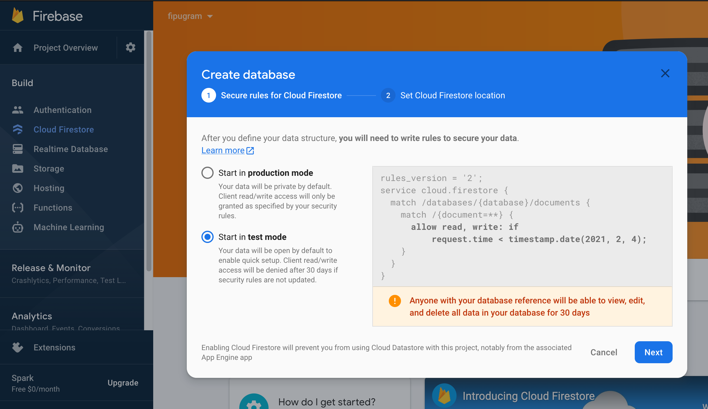

# Vue.js - Cloud Firestore

U ovoj vježbi prikazivat ćemo integraciju Firebase baze (Cloud Firestore).

## Inicijalizacija

1. Kod sa prethodnih VUE-04 vježbi možemo preuzeti s GitHuba. Repozitorij: https://github.com/fipu-nastava/fipugram (branch `step4`). Preuzimanje s Git-a, instaliranje paketa i pokretanje aplikaciije pojašnjeno je u prethodnim vježbama.

1. Usluzi Firebase baze pristupa se pomoću Firebase web konzole (https://console.firebase.google.com/). Potrebno je pristupiti projektu te u sklopu njega uslugu `Cloud Firestore`. Kreirajte novu bazu i odaberite "test mode". Odaberite europsku regiju (nije toliko važno).
  


   **Slika 1.** Cloud Firestore usluga.


Firebase je organiziran u **kolekcije** dokumenata. Analogno na relacijsku bazu možemo to promatrati kao **tablice** redaka. Semantika dokumenta je u Firebase-u nalik na redak u tablici s tom razlikom da se dokumenti dohvaćaju i predaju pomoću JS Firebase knjižnice u obliku Javascript objekata. Kolekcije objekata nije potrebno unaprijed definirati, već Firebase automatski otvara nove kolekcije kako zaprimi objekte iz naše aplikacije.

Kako bi u našoj aplikaciji dodali mogućnost pristupanja Cloud Firestore-u potrebno je doraditi `firebase.js` modul:

```javascript
// ...

// Initialize Firebase
firebase.initializeApp(firebaseConfig);

let db = firebase.firestore();

export { firebase, db };
```

## Spremanje novog posta na Firebase

Sada ćemo definirati novu HTML formu za slanje Fipugram *post-a*. Trenutno ćemo je smjestiti u `views/Home.vue`. U tu svrhu potreban nam je `<form>`element koji u sebi sadrži `<input>` element u koji korisnik može unijeti adresu slike i opis  te naposljetku i `<button>` element koji pokreće akciju dodavanja *post-a*:

```html
<template>
    <div class="row">
        <div class="col-8">
            <!-- nova forma za post -->
            <form @submit.prevent="postNewImage" class="form-inline mb-5">
                <div class="form-group">
                    <label for="imageUrl">Image URL</label>
                    <input
                        v-model="newImageUrl"
                        type="text"
                        class="form-control ml-2"
                        placeholder="Enter the image URL"
                        id="imageUrl"
                    />
                </div>
                <div class="form-group">
                    <label for="imageDescription">Description</label>
                    <input
                        v-model="newImageDescription"
                        type="text"
                        class="form-control ml-2"
                        placeholder="Enter the image description"
                        id="imageDescription"
                    />
                </div>
                <button type="submit" class="btn btn-primary ml-2">Post image</button>
            </form>
            <!-- listanje kartica -->
            <instagram-card v-for="card in filteredCards" :key="card.id" :info="card" />
        </div>
        <div class="col-4">
            Sidebar
        </div>
    </div>
</template>
```

Novu formu možemo privremeno smjestiti iznad listanja postojećih postova sa `v-for`.  Kako bi mogli dohvatiti korisnički upisani URL nove slike moramo ga povezati sa određenom varijablom iz `data` dijela Vue komponente koja će biti povezana s onime što korisnik unese u `input` element (podsjetimo se, u Vue.jsu se to povezivanje ostvaruje `v-model` deklaracijom). Dakle dodajemo u `data()` metodu:

```javascript
// ...
data: function() {
        return {
            cards,
            store,
            newImageUrl: '', // <-- url nove slike
            newImageDescription: '', // <-- opis nove slike
        };
    },
// ...
```

Akcija `@submit.prevent="postNewImage"`definirana u sklopu `form` elementa poziva metodu koju moramo definirati u `<script>`dijelu Vue komponente (u ključu `methods`). Za provjeru, možemo novu metodu postaviti kao:

```javascript
import InstagramCard from '@/components/InstagramCard.vue'
import store from '@/store.js'

export default {
  //...
  methods: {
    postNewImage() {
      console.log("Dodajem novu sliku:", this.newImageUrl);
		  // ovdje će ići Firebase kod
    }
  },
  //...
}
```

No ono što zaista hoćemo od `postNewImage`metode jest da doda novi post u Firebase kolekciju koju ćemo prozvati `posts`. Zamijeno dakle sadržaj metode sa sljedećim:

```javascript
//...
import { db } from '@/firebase';

//...
methods: {
    postNewImage() {
      db.collection("posts").add({
        url: this.newImageUrl,
        email: store.currentUser,
        posted_at: Date.now(),
        desc: this.newImageDescription,
      })
    }
  },
//...
```

Dakle pozivamo metodu `add()` (dokumentacija: https://firebase.google.com/docs/firestore/manage-data/add-data#add_a_document) kojoj predajemo Javascript objekt. `Date.now()` je funkcija koja vraća trenutno vrijeme, a `this.userEmail` je polje iz `store.js` u kojeg pohranjujemo e-mail trenutno ulogiranog korisnika (ta se funkcionalnost nalazi u `mounted` metodi u `App.vue`). 
Kako bi isprobali dodavanje, dodajmo nekoliko slika (npr. https://picsum.photos/500/500) i uvjerimo se da su spremljene u Firestore pomoću Firebase web konzole.

## Implementacija dohvata postova

Sada ćemo zamijeniti trenutno čitanje postova iz lokalne varijable sa postovima koje smo spremili u `"posts"`kolekciju Firestorea. Prisjetimo se, trenutno su postovi definirani u `Home.vue` datoteci u varijabli `cards`. Dakle moramo isprazniti ručno popunjen `Array` `cards`  i puniti ga slikama koje ćemo učitati iz Firestorea. Prvo, postavimo `cards` na prazan `Array` kojeg ćemo pri podizanju aplikacije puniti čitanjem iz Firestorea, a kod za dohvat postova postavit ćemo u novu metodu komponente `getPosts`:


   ```javascript
// ...
export default {
    name: 'home',
    data: function() {
        return {
            cards: [], // postavljamo na prazno, punit ćemo iz Firebasea
            store,
            newImageUrl: '',
            newImageDescription: '',
        };
    },
    methods: {
        getPosts() {
            let cards = [];

            //... API/Firebase -> sve kartice -> cards
            console.log('Loading posts');

            db.collection('posts')
                .orderBy('posted_at', 'desc')
                .limit(10)
                .get()
                .then((results) => {
                    results.forEach((doc) => {
                        let id = doc.id;
                        let data = doc.data();
                        let card = {
                            id: doc.id,
                            url: data.url,
                            time: data.posted_at,
                            description: data.description,
                        };

                        this.cards.push(card);
                    });
                });
        },
      
      // ...
   ```

Zatim ćemo dodati u metodu `mounted` komponente `Home.vue` koja se uvijek poziva kada se komponenta pojavi:

   ```javascript
// ...
export default {
    name: 'home',
    // ...
    mounted() {
        this.getPosts();
    },
// ...
   ```

 Upit se sastoji od sljedećih poziva metoda: `db.collection("posts").orderBy("posted_at").limit(10)`te se može smatrati kao analogan primjer SQL upitu `select * from posts order by posted_at limit 10`, ali za i kroz Firebase API. Detalje o upitima možete pregledati na: https://firebase.google.com/docs/firestore/query-data/queries

Kako bi vrijeme prikazali u ljepšem formatu i relativnom vremenu (npr. "15 minutes ago…") možemo koristiti paket `momentjs`.
Potrebno ga je instalirati kroz `npm` unutar konzole:

```bash
cd <direktorij projekta>
npm install moment --save          # ovo instalira paket i sprema tu informaciju u packages.json
```

Zatim u komponenti `Instagram.vue` dodajemo novu `computed`metodu, čime dobivamo atribut koji se dinamički računa:

```html
<script>
import moment from 'moment';

//JS kod
export default {
    props: ['info'],
    name: 'InstagramCard',
    computed: {
        postedFromNow() {
            return moment(this.info.time).fromNow();
        },
    },
};
</script>
```

te postavljamo u `<template>`element pozivanje tog dinamičkog atributa:

```html
...
  <div class="card-footer text-left">
    {{ postedFromNow }}
  </div>
...
```

## Zadaci

1. Napraviti da se **Fipugram** postovi automatski osvježavaju nakon što se doda novi post.
1. Stilizirati formu za unos novog posta.
1. Postaviti poruku o uspješnom dodavanju novog posta.
