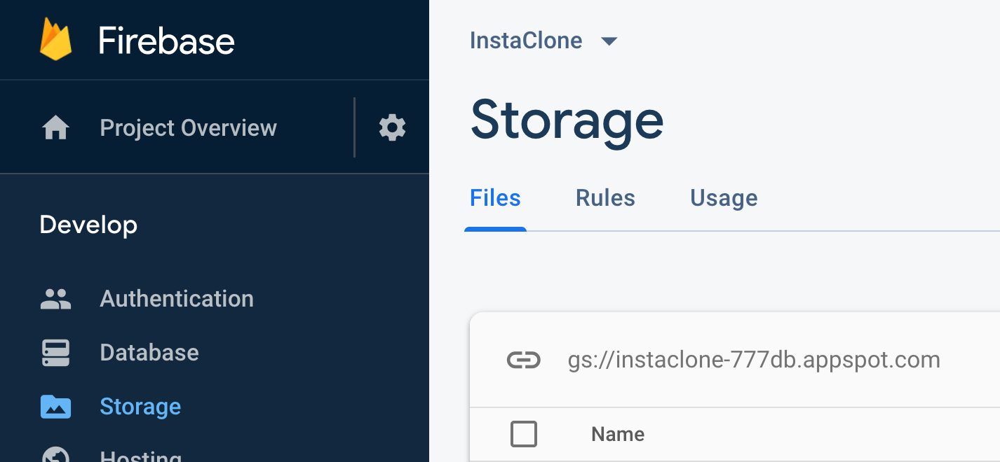

# Vue.js - Upload slika i datoteka na Firebase

U ovoj vježbi pokazat ćemo mogućnost realiziracije `drag&drop` komponente za upload stvarnih slika (ne samo URL-ova) na Firebase.

## Koraci

1. Kod sa prethodnih VUE-05 vježbi možemo preuzti s GitHuba. Repozitorij: https://github.com/dbulic/instaclone (branch `plan-wk5`). Preuzimanje s Git-a, instaliranje paketa i pokretanje aplikaciije pojašnjeno je u prethodnim vježbama.

1. U prethodnim vježbama pohranjivali smo u `Cloud Firestore` Instaclone *postove* na način da je svaki *post* sadržavao URL slike. U ovoj vježbi to ćemo nadograditi na način da svaki post sadrži stvarnu sliku koji korisnik može dodati s vlastitog računala ili mobitela. Za tu funkcionalnost treba nam baza podataka koja može sačuvati stvarne vrijednosti pixela pojedinih slika. Koristit ćemo `Cloud Storage`.
  Usluzi Firebase baze pristupa se pomoću Firebase web konzole (https://console.firebase.google.com/). Potrebno je pristupiti projektu te u sklopu njega uslugu `Database` i to specifično `Storage.

   
   **Slika 1.** Cloud Storage usluga.
  
      Firebase Storage omogućuje pohranu datoteka i direktorija. Sadržaju storage-a moguće je pristupiti putem javnih URL-ova (zavisno o konfiguraciji). Podesit ćemo `Rules` sekciju da omogućimo svima čitanje, a samo autentificiranim korisnicima pisanje:
  
   ```c
   rules_version = '2';
   service firebase.storage {
     match /b/{bucket}/o {
       match /{allPaths=**} {
         allow read, write: if request.auth != null;
       }
     }
   }
   ```
  
     
  
1. Kako bi u našoj aplikaciji dodali mogućnost korištenja potrebnih knjižnica za Cloud Storage potrebno je uključiti sljedeće pakete u datoteci `public/index.html`:

   ```html
   <script src="https://www.gstatic.com/firebasejs/7.5.1/firebase-storage.js"></script>
   <script>
   	//	... ostaviti sadržaj prethodnih vježbi
   
   	var db = firebase.firestore(); // uključili u prethodnoj vježbi
      var storage = firebase.storage();
   </script>
   ```


   Primjetimo kako smo i ovoga puta definirali globalnu Javascript `storage` varijablu kojoj možemo pristupiti iz svih `Vue` modula. Globalna je zbog toga što je definirana u tzv. globalnom *scope-u*unutar `<script/>`HTML elementa.

1. Time smo u naš projekt dodali mogućnost korištenja Storage API-a. Storage API funkcionira na način da možemo prenijeti sadržaj Javascript `Blob` tipa varijabli (https://developer.mozilla.org/en-US/docs/Web/API/Blob). `Blob` u Javascriptu može sadržavati niz bajtova u izvornom (`raw`) obliku. Dakle da bi napravili mogućost pohrane slike u Storage moramo to učiniti u dva koraka:
   **Korak 1.** Omogućiti korisniku odabir slike i pohraniti sliku u Javascript `Blob` objekt.
   **Korak 2. ** Pomoću Storage API-a pohraniti `Blob` objekt na `Storage`.

1. **Implementacija prvog koraka**: korisnički odabir slike. U tu svrhu koristit ćemo komponentu `Vue croppa`. Postoji veliki broj komponenti te je odabir prave komponente često veoma zahtjevan proces (svaku komponentu treba pravilno uključiti u projekt, iskonfigurirati i uvjeriti se da zadovoljava naše potrebe). Zbog toga je poželjno uključiti provjerene komponente koje su već dizajnirane da rade s **Vue.js**-om. Github profil komponente: https://github.com/zhanziyang/vue-croppa

   **Instalacija komponente**. Komponente možemo instalirati na dva načina: a) pomoću `npm`a ili, b) ručno dodavanjem skripti u `index.html`. Primjerice Firebase smo uključili na drugi način, a `moment` komponentu smo prethodno instalirali na prvi način. Ovu ćemo komponentu također instalirati preko `npm`a:

   ```bash
   cd <direktorij_projekta>
   npm install --save vue-croppa
   ```

   Time se naša komponenta automatski nadodaje u `packages.json` datoteku našeg projekta kao komponenta koja je potrebna za rad projekta. Samim time možemo ju koristiti u određenoj komponenti pomoću `import` JavaScript naredbe. Ukoliko želimo da komponenta bude dostupna u svim ostalim komponentama možemo modificirati `main.js` datoteku:

   ```javascript
import Vue from 'vue'
   import App from './App.vue'
   import router from './router'
   import Croppa from 'vue-croppa' // import nove komponente
   
   Vue.use(Croppa) // Kaže Vue-u da ćemo tu komponentu koristiti 
   Vue.config.productionTip = false
   
   new Vue({
     router,
     render: h => h(App)
   }).$mount('#app')
   
   ```
   
   Nakon što smo registrirali korištenje komponente `Croppa` možemo ju koristiti u `<template>`dijelu `Home.vue` komponente umjesto staroga `<input>`elementa:
   
   ```html
   <form @submit.prevent="postImage" class="mb-5">
     <croppa :width="400" :height="400" v-model="imageData"></croppa>
     <button type="submit" class="btn btn-primary ml-2">Post image</button>
   </form>
   ```
   
   Komponenta `croppa`  povezana je sa (*bound with*) `imageData` varijablom, pa je i nju potrebno dodati u `store.js`datoteku (možemo ju početno postaviti na `null`). `Blob` slike možemo izvući sa:
   
   ```javascript
   this.imageData.generateBlob(data => {
     console.log(data); // ovo daje bajtove u konzolu...
   })
   ```
   
1. **Implementacija drugog koraka (Blob → Storage)**.
   Metoda `postImage` koja se poziva na *submit* forme mora raditi u 3 koraka:

   1. Generiranje `Blob` objekta,
   1. Upload slike na Firebase Storage, 
   1. Dohvat njezinog javnog URL-a (dostupnog HTTP-om)
   1. Spremanje Instaclone posta u Firebase Firestore.

   Sva tri koraka su asinkrona. Asinkronost se sastoji u tome da se pozvana funkcija izvršava duže i zbog toga svoj rezultat ne vraća odmah, nego kasnije kroz *callback* funkciju. Zgodna prilika da primjetimo razliku između asinkrone i sinkrone funkcije:

   ```javascript
   // primjer pozivanja sinkrone funkcije
   console.log("1: Prije poziva sinkrone funkcije...")
   let rezultat = pozivSinkroneFunkcije(parametri)
   console.log("2: Nakon poziva sinkrone funkcije rezultat je odmah dostupan.")
   
   // primjer pozivanja ASINKRONE funkcije
   console.log("3: Prije poziva asinkrone funkcije...")
   pozivAsinkroneFunkcije(parametri).then(rezultat => {
     console.log("5: Dohvat rezultata nakon završetka izvođenja asinkrone funkcije")
   })
   console.log("4: Nakon poziva asinkrone funkcije")
   ```

   *Primjer pozivanja asinkronog i sinkronog koda. Primjeti kako se "5" događa nakon "4" iako je locirano u kodu iznad!*

   Asinkrone funkcije imaju rezultat dostupan unutar posebne funkcije koju registriramo u `.then()`dijelu. Pogledajmo još i kako se obrađuju greške: `Exception`.

   ```javascript
   // primjer hendlanja greški...
   
   console.log("1: Prije poziva sinkrone funkcije...")
   try {
   	let rezultat = pozivSinkroneFunkcije(parametri)
   } catch(e) {
     console.error(e);
   }
   console.log("2: Nakon poziva sinkrone funkcije rezultat je odmah dostupan.")
   
   console.log("3: Prije poziva asinkrone funkcije...")
   pozivAsinkroneFunkcije(parametri)
      .then(rezultat => {
         console.log("5a: Dohvat rezultata nakon završetka izvođenja asinkrone funkcije")
      })
   	.except(e => {
         console.log("5b: Ukoliko ima greške ne poziva se '.then()' i obratno")
         console.error(e)
      })
   console.log("4: Nakon poziva asinkrone funkcije")
   ```

   Ponekad je potrebno izvesti dvije asinkrone funkcije slijedno na način da rezultat prve je potreban u drugoj funkciji:

   ```javascript
   prvaAsinkronaFunkcija()
   	.then(rezultat => {
     	 let parametar = rezultat
     	 drugaAsinkronaFunkcija(parametar)
     		 .then(noviRezultat => {
          			console.log(noviRezultat)
        	})
   	})
   ```

   *Primjer slijednog pozivanja dviju asinkronih funkcija*

   Povratak na naš primjer. Potrebno je u tri koraka: 1) dohvatiti sliku, 2) uploadati sliku, 3) dohvatiti njezin javni Firebase url, 4) poslati post:

   ```javascript
     methods: {
       postImage() {
         this.imageData.generateBlob(blobData => {
           if (blobData != null) {
             // ako koristimo "/" u nazivu slike, Storage fino napravi direktorij.
             // Konkretno u ovom primjeru imat ćemo direktorij nazvan po mailu korisnika.
             // Slika će biti nazvana po trenutnom vremenu kako bi imali jedinstveni naziv slike.
             let imageName = this.userEmail + "/" + Date.now() + ".png";
   
             storage
               .ref(imageName)
               .put(blobData)
               .then(result => {
                 result.ref.getDownloadURL()
                   .then(url => {
                     db.collection("posts")
                       .add({
                         email: this.userEmail,
                         posted_at: Date.now(),
                         url: url
                       })
                       .then(docRef => {
                         console.log("Document written with ID: ", docRef.id);
                         this.imageData = null;
                       })
                       .catch(e => {
                         console.error("Error adding document: ", error);
                       });
                   })
                   .catch(e=> {
                     console.error(e)
                   })
               })
               .catch(e => {
                 console.error(e)
               })
           }
         }); // da... zatvaranje zagrada nakon ovoga noćna je mora!
       }
     }
   ```

   *Kod smješten u metodi koja se poziva na submit forme.*

   

   Time smo dobili mogućnost uploada slike. Ispis postova radi kao i ranije s tom razlikom da su sada slike smještene na Firebaseu.

   