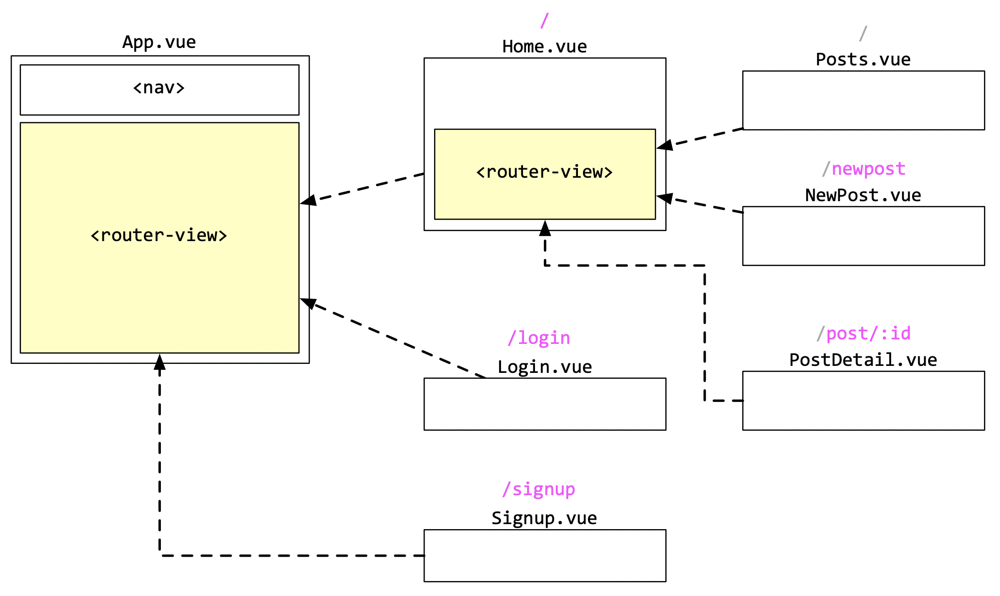
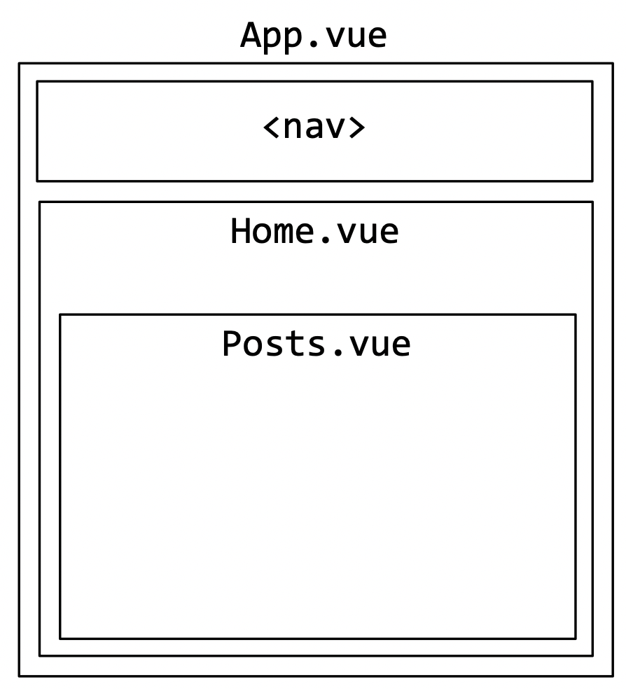

# Vue.js - Ugnježdene rute i podkolekcije

U ovoj vježbi prikazivat ćemo integraciju navigaciju kroz kompleksnije rute i proslijeđivanje ugnježdenih podataka. Također prikazat ćemo na koji način možemo u Firebase-u spremiti vezane dokumente (veza 1 na više).

## Koraci

1. Kod sa prethodnih VUE-07 vježbi možemo preuzeti s GitHuba. Repozitorij: https://github.com/fipu-nastava/fipugram (branch `step7`). Preuzimanje s Git-a, instaliranje paketa i pokretanje aplikaciije pojašnjeno je u prethodnim vježbama.

1. U ovom ćemo koraku urediti korisničke rute kroz aplikaciju i zadužene komponente. To je jedan od važnijih koraka prilikom dizajna aplikacije. Preporuča se da svaka glavna funkcionalnost u aplikaciji ima vlastiti **endpoint, url ili rutu** (istoznačnice). To nam je važno kako bi naši korisnici mogli lako podijeliti url bilo kojeg dijela aplikacije.. Uredit ćemo rute Fipugram aplikacije na sljedeći način:
  
  
  *Slika 1. Korisničke rute kroz aplikaciju*
  
  Glavna i početna ruta kroz aplikaciju jest početna ruta:"/" ili zavisno o konfiguraciji i mjestu izvođenja: "http://localhost:8080/". Iz slike 1. je vidljivo kako će ta ruta prikazivati tri ugnježdene komponente:
  
  
  *Slika 2. Konačan izgled početne rute*
  
  Konfiguracijom rutera pomoću `router/index.js`datoteke projekta možemo postići navedeni kompoziciju (no prije toga potrebno je stvoriti nove prazna komponente `NewPost.vue`, `PostDetail.vue`, `Posts.vue`):
  
  ```javascript
  //...
  const routes = [
    {
      path: '/',
      name: 'home',
      component: Home,
      children: [
        {
          path: '',
          name: 'posts',
          component: Posts
        },
        {
          path: 'newpost',
          name: 'newpost',
          component: () => import(/* webpackChunkName: "post" */ '../views/NewPost.vue')
        },
        {
          path: 'post/:id',
          props: true, // važno da nam se puni "id" kao parametar komponente "PostDetail.vue"
          name: 'post-detail',
          component: () => import(/* webpackChunkName: "post-detail" */ '../views/PostDetail.vue')
        }
      ]
    },
    {
      path: '/login',
      name: 'login',
      component: () => import(/* webpackChunkName: "login" */ '../views/Login.vue')
    },
    {
      path: '/signup',
      name: 'signup',
      component: () => import(/* webpackChunkName: "signup" */ '../views/Signup.vue')
    },
  ]
  //...
  ```
  
  Komponente u ruti mogu biti unaprijed učitane (npr. `Home`i `Posts` komponenta) ili dinamički učitane na zahtjev (npr. ostale komponente pomoću `import` metode). Rezultat je isti, razlika je u tome što nam je važnije i u kojem trenutku želimu učitati dodatne komponente (odmah pri startu ili kasnije kada ih korisnik zatraži).
  
1. Izdvojit ćemo funkcionalnost listanja postova (`InstagramCard` koji ima `v-for`) u komponentu `Posts.vue` te u mjesto koda za unos novog posta postaviti `Button` koji vodi na stranicu `/newpost`.

   ```html
   <template>
     <div v-if="authenticated">
       <button @click="newImage()" type="Novi post" class="btn btn-primary ml-2">
         Post new image
       </button>
       <div @click="gotoDetails(card)" :key="card.id" v-for="card in filteredCards">
         <InstagramCard :info="card"/>
       </div>
     </div>
   </template>
   
   <script>
   import InstagramCard from "@/components/InstagramCard.vue";
   import store from "@/store.js";
   
   export default {
     data() {
       return store;
     },
     computed: {
       filteredCards() {
         return this.cards.filter(card => card.title.includes(this.searchTerm));
       }
     },
     name: "posts",
     methods: {
       gotoDetails(card) {
         this.$router.push({path: `post/${card.id}`})
       },
       newImage() {
         this.$router.push({name: 'newpost'}).catch(err => console.log(err))
       }
     },
     components: {
       InstagramCard
     },
   }
   </script>
   
   <style scoped>
     button {
       margin-bottom: 20px
     }
   </style>
   ```

   *Sadržaj komponente `Posts.vue`*

   Primjetimo nekoliko bitnih stvari. Ruta za prikaz detalja pojedinog posta ima i parametar `post/:id` te samim time u metodi `gotoDetails(card)` moramo navesti točan `id` posta u `this.$router.push({path: 'post/${card.id}'})`. Dakle vidimo kako možemo imati *dinamičke* rute koje primaju parametre. Zavisno o parametru `id` ruta `post/:id` prikazivat će točno određeni instaclone post.

   Time je sadržaj `Home.vue` komponente značajno reduciran na samo `<router-view/>`:

   ```html
   <template>
     <div class="row">
       <div class="col-8">
         <router-view/>
       </div>
       <div class="col-4"></div>
     </div>
   </template>
   
   <script>
   import store from "@/store.js";
   
   export default {
     data() {
       return store;
     },
     name: "home"
   };
   </script>
   ```

   *Sadržaj komponente `Home.vue`*

1. Sljedeći korak je implementacija komponente za unos novog posta na ruti `/newpost`u koju ćemo prebaciti sve relevantne dijelove iz bivšeg `Home.vue` vezane uz upload nove slike:

   ```html
   <template>
     <form @submit.prevent="postImage" class="mb-5">
       <croppa :width="400" :height="400" v-model="imageData"></croppa>
       <button type="submit" class="btn btn-primary ml-2">Post image</button>
     </form>
   </template>
   
   <script>
   import store from "@/store.js";
   
   export default {
     data() {
       return store
     },
     name: "newpost",
     methods: {
       postImage() {
         this.imageData.generateBlob(blobData => {
           if (blobData != null) {
             // ako koristimo "/" u nazivu slike, Storage fino napravi direktorij.
             // Konkretno u ovom primjeru imat ćemo direktorij nazvan po mailu korisnika.
             // Slika će biti nazvana po trenutnom vremenu kako bi imali jedinstveni naziv slike.
             let imageName = this.userEmail + "/" + Date.now() + ".png";
   
             storage
               .ref(imageName)
               .put(blobData)
               .then(result => {
                 result.ref.getDownloadURL()
                   .then(url => {
                     db.collection("posts")
                       .add({
                         email: this.userEmail,
                         posted_at: Date.now(),
                         url: url
                       })
                       .then(docRef => {
                         console.log("Document written with ID: ", docRef.id);
                         this.imageData = null;
                         this.$router.push({name: "posts"})
                       })
                       .catch(e => {
                         console.error("Error adding document: ", error);
                       });
                   })
                   .catch(e=> {
                     console.error(e)
                   })
               })
               .catch(e => {
                 console.error(e)
               })
           }
         }); // da... zatvaranje zagrada nakon ovoga noćna je mora!
       }
     }
   };
   </script>
   
   <style lang="scss">
   
   .card-body {
     padding: 0px;
   }
   
   img:hover {
     cursor: pointer;
   }
   
   .btn-post {
     width: 200px;
   }
   
   .croppa-container {
     border: 3px dashed gray;
     width: 400px;
     display: block;
     margin-bottom: 10px;
   }
   </style>
   ```

1. U ovom korako implemenitrati ćemo komponentu `PostDetail.vue` koje će zasebno prikazati samo jedan post zajedno s njegovim komentarima. Prvo modificirat ćemo komponentu `InstagramCard.vue`na način da prikazuje komentare i dopušta unos novog komentara. Komentare ćemo spremiti u podkolekciju prethodne kolekcije `posts`:

   ```html
   <template>
   
         <div class="card text-center">
           <div class="card-header text-left">
             By <strong>{{ info.email }}</strong>
           </div>
           <div class="card-body">
             
           </div>
           <div class="card-footer text-left">
             <div>{{ timeAgo }}</div>
   
             <!-- ⇩ ⇩ NOVO ⇩ ⇩ -->
             <div v-if="showcomments">
               <div class="comments list-group">
                 <a :key="c.posted_at" v-for="c in comments" href="#" class="animate list-group-item list-group-item-action flex-column align-items-start">
                   <div class="d-flex w-100 justify-content-between">
                     <small>{{ formatTime(c.posted_at) }} by {{ c.email }} </small>
                   </div>
                   <small>{{ c.comment }}</small>
                 </a>
               </div>
   
               <form @submit.prevent="postComment" class="form-inline mb-5">
                 <div class="form-group">
                   <input v-model="newComment" type="text" class="form-control" id="imageUrl" placeholder="Any comment?">
                 </div>
                 <button type="submit" class="btn btn-primary ml-2">Post</button>
               </form>
             </div>   
             <!-- ⇧ ⇧ NOVO ⇧ ⇧ -->
   
           </div>
         </div>
   
   </template>
   
   <script>
   import moment from 'moment'
   import store from '@/store.js'
   
   export default {
     props: [ "info", "showcomments" ],
     data () {
       return {
         global: store,
         newComment: "",
         comments: []
       }
     },
     // ⇩ ⇩ ⇩ ⇩ NOVO ⇩ ⇩ ⇩ ⇩
     mounted() {
       if (this.showcomments) {
        // pristup podkolekciji, koja mora za svog roditelja imati konkretni dokument nadkolekcije
        // u ovom slučaju: komentari su dio konkretnog instaclone posta
        db.collection("posts").doc(this.info.id).collection("comments").onSnapshot(snapshot => {
           snapshot.docChanges().forEach(change => {
             if (change.type === "added") {
               let comment = change.doc.data();
               comment.isNew = true;
               console.log(comment);
               this.comments.unshift(comment)
             }
           })
        })
       }
     },
     methods: {
       formatTime(t) {
         return moment(t.posted_at).fromNow()
       },
       postComment() {
         if (this.newComment) {
           db.collection("posts") // kolekcija roditelj
             .doc(this.info.id) // konkretni post
               .collection("comments") // podkolekcija
               .add({ email: this.global.userEmail, comment: this.newComment, posted_at: Date.now() })
                 .then(result => {
                   console.log(result)
                   this.newComment = "";
                 })
                 .catch(e => {
                   console.error(e)
                 })
         }
       }
     },
     // ⇧ ⇧ ⇧ ⇧ NOVO ⇧ ⇧ ⇧ ⇧
     computed: {
       timeAgo () {
         return moment(this.info.posted_at).fromNow()
       }
     }
   }
   </script>
   
   <style>
     .card {
       margin: 10px
     }
     .comments {
       margin: 20px 0
     }
   
     /* ----------------------------------------------
     * Generated by Animista on 2020-1-3 19:19:35
     * Licensed under FreeBSD License.
     * See http://animista.net/license for more info. 
     * w: http://animista.net, t: @cssanimista
     * ---------------------------------------------- */
     @-webkit-keyframes fade-in-fwd{0%{-webkit-transform:translateZ(-80px);transform:translateZ(-80px);opacity:0}100%{-webkit-transform:translateZ(0);transform:translateZ(0);opacity:1}}@keyframes fade-in-fwd{0%{-webkit-transform:translateZ(-80px);transform:translateZ(-80px);opacity:0}100%{-webkit-transform:translateZ(0);transform:translateZ(0);opacity:1}}
     .animate{-webkit-animation:fade-in-fwd 1s cubic-bezier(.39,.575,.565,1.000) both;animation:fade-in-fwd 1s cubic-bezier(.39,.575,.565,1.000) both}
   
   </style>
   ```


   Zatim ćemo oblikovati komponentu `PostDetail.vue` koja koristi proširenu komponentu `InstagramCard`:

   ```html
   <template>
     <div v-if="card">
       <InstagramCard :info="card" :showcomments="true"/>
     </div>
   </template>
   
   <script>
   import InstagramCard from "@/components/InstagramCard.vue";
   import store from "@/store.js";
   
   export default {
     props: ['id'],
     data() {
       return {
         card: null
       }
     },
     mounted() {
       console.log(this.id);
       db.collection("posts")
         .doc(this.id).get().then(doc => {
           this.card = doc.data();
           this.card.id = doc.id;
         })
     },
     name: "post-detail",
     components: {
       InstagramCard
     },
   }
   </script>
   
   <style scoped>
     button {
       margin-bottom: 20px
     }
   </style>
   ```

   Važno je da komponenti `InstagramCard` proslijedimo parametar `:showcomments="true"` kako bi prikazivala komentare. Druga važna stvar je da ova komponenta ima `props: ["id"]` gdje se parametar `id` puni iz putanje rute npr. http://localhost:8080/post/QL5JBGHrmpwh2WgiAf8P dakle `id = QL5JBGHrmpwh2WgiAf8P`. Vue automatski puni taj parametar za nas jer smo u ruti postavili `props = true` (vidi Korak 2.)


